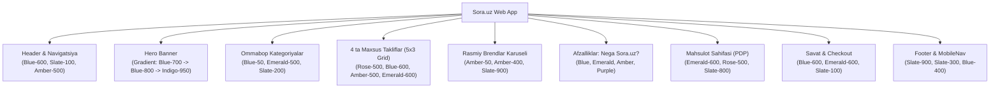

# Sora.uz — Veb-Ilova Dizayn Ranglari Tizimi (Design Colors Documentation)

Ushbu hujjat **Sora.uz** elektron tijorat (e-commerce) platformasida qo'llanilgan barcha ranglar, dizayn tokenlari, Tailwind CSS sinflari hamda ularning qayerda va qanday maqsadda ishlatilganligini to'liq ifodalaydi.

---

## 1. Umumiy Rang Arxitekturasi va Dizayn Prinsiplari

Platforma **Tailwind CSS v4** va zamonaviy **Design Tokens (CSS Variables)** arxitekturasiga asoslangan. Tizim to'liq **Dual-Theme (Light Mode va Dark Mode)** qo'llab-quvvatlashiga ega bo'lib, foydalanuvchi qurilmasi yoki tizim sozlamalariga mos ravishda avtomatik moslashadi.

* **Asosiy brend rangi (Primary Brand Color):** Chuqur professional moviy rang (`Blue-600` / `#1e40af` va `#3b82f6`). Ofis jihozlari, ishonchlilik va qulaylik ramzi.
* **Aksiya va Diqqat rangi (Accent / Call-to-Action):** Issiq qahrabo va oltin rang (`Amber-500` / `Orange` / `#f97316`). Yuqori konversiyali harakat tugmalari, reyting yulduzlari va xit mahsulotlar uchun.
* **Muvaffaqiyat va Sinxronizatsiya (Success & Sync):** Yorqin zumrad yashil (`Emerald-500`, `Emerald-600` / `#10b981`). 1C ERP integratsiya holati, savatga qo'shilganlik tasdig'i va omborda mavjudlik ko'rsatkichi.
* **Chegirma va Ogohlantirish (Destructive & Discount):** Jonli atirgul qizil (`Rose-500`, `Rose-600` / `#ef4444`). Chegirmalar foizi, maxsus narxlar, sevimlilar yuragi va mahsulot qolmaganlik holati.
* **Neytral fon va tipografiya (Neutral Slate):** Kontrast va qulay mutolaa uchun `Slate` oilasidagi 11 ta gradiatsiya (`Slate-50` dan `Slate-950` gacha).

---

## 2. Global CSS O'zgaruvchilari (Design Tokens — `globals.css`)

Ushbu o'zgaruvchilar ilovaning poydevorini tashkil etadi va `src/app/globals.css` faylida belgilangan.

| O'zgaruvchi (CSS Variable) | Light Mode (HEX) | Dark Mode (HEX) | Semantik Vazifasi va Qo'llanish Joyi |
| :--- | :--- | :--- | :--- |
| `--background` | `#f8fafc` (slate-50) | `#090d16` (deep dark) | Butun ilova sahifalarining umumiy orqa foni (`body`) |
| `--foreground` | `#0f172a` (slate-900) | `#f8fafc` (slate-50) | Asosiy matn, sarlavhalar va tana matnlari rangi |
| `--card` | `#ffffff` (white) | `#111827` (slate-900) | Kartochkalar, bloklar va modallar orqa foni |
| `--card-foreground` | `#0f172a` (slate-900) | `#f8fafc` (slate-50) | Kartochkalar ichidagi matn rangi |
| `--popover` | `#ffffff` (white) | `#111827` (slate-900) | Ochiluvchi menyular (Dropdown, Autocomplete, Tooltip) foni |
| `--popover-foreground`| `#0f172a` (slate-900) | `#f8fafc` (slate-50) | Ochiluvchi menyular matn rangi |
| `--primary` | `#1e40af` (blue-800) | `#3b82f6` (blue-500) | Birlamchi harakat tugmalari, brend logotipi, asosiy havolalar |
| `--primary-foreground` | `#ffffff` (white) | `#ffffff` (white) | Primary tugmalar ichidagi oq matn |
| `--primary-hover` | `#1d4ed8` (blue-700) | `#2563eb` (blue-600) | Primary elementlar ustiga sichqoncha borgandagi (hover) holati |
| `--secondary` | `#f1f5f9` (slate-100) | `#1f2937` (slate-800) | Ikkilamchi tugmalar, teglar va fon yostiqchalari |
| `--secondary-foreground` | `#1e293b` (slate-800) | `#f8fafc` (slate-50) | Secondary elementlar matn rangi |
| `--accent` | `#f97316` (orange-500)| `#fb923c` (orange-400)| Qiziqtiruvchi aksiyalar, yorqin aksentlar |
| `--accent-foreground` | `#ffffff` (white) | `#090d16` (deep dark)| Accent elementlar matn rangi |
| `--muted` | `#f1f5f9` (slate-100) | `#1e293b` (slate-800)| Noaktiv elementlar, yordamchi fonlar |
| `--muted-foreground` | `#64748b` (slate-500) | `#94a3b8` (slate-400)| Yordamchi tushuntirish matnlari, placeholderlar, SKU/artikul matnlari |
| `--destructive` | `#ef4444` (red-500) | `#ef4444` (red-500) | Xatoliklar, savatdan o'chirish, ogohlantirishlar |
| `--destructive-foreground`| `#ffffff` (white) | `#ffffff` (white) | Destructive tugmalar matni |
| `--success` | `#10b981` (emerald-500)| `#10b981` (emerald-500)| Muvaffaqiyat xabarlari, omborda mavjudlik belgisi |
| `--success-foreground` | `#ffffff` (white) | `#ffffff` (white) | Success elementlar matni |
| `--border` | `#e2e8f0` (slate-200) | `#1e293b` (slate-800)| Ajratuvchi chiziqlar, kartochka va input chegaralari |
| `--input` | `#e2e8f0` (slate-200) | `#1e293b` (slate-800)| Forma kiritish maydonlarining chegarasi |
| `--ring` | `#3b82f6` (blue-500) | `#60a5fa` (blue-400)| Input va tugmalar fokuslangandagi kontur (Focus Ring) |

---

## 3. Rang Oilalari (Color Families & Palettes)

### 3.1. Moviy Ranglar (Brand Blue Palette)
Ilovaning bosh vizual o'qi bo'lib, jami **46 ta holatda** qo'llaniladi.

| Tailwind Token | HEX / RGB | Qo'llanish Maqsadi va Elementlar |
| :--- | :--- | :--- |
| `blue-50` | `#eff6ff` | Kategoriya kartasi ikonka foni, info-bannerlar foni, qidiruv natijalari yostiqchasi |
| `blue-100` | `#dbeafe` | "Tezkor yetkazib berish" va "Kafolatlangan eng arzon narx" bo'lim sarlavhalari ikonka foni |
| `blue-200` | `#bfdbfe` | Hero banner teglari va sub-sarlavha matnlari |
| `blue-300` | `#93c5fd` | Qorong'i rejimdagi yordamchi matnlar va kartochka hover konturi |
| `blue-400` | `#60a5fa` | Qorong'i rejimdagi havolalar, matn aksentlari va Footer havolalari |
| `blue-500` | `#3b82f6` | Qidiruv maydoni aktiv chegarasi (`focus:border-blue-500`), radio/checkbox elementlar |
| `blue-600` | `#2563eb` | Asosiy harakat tugmalari ("Savatga", "Buyurtma berish"), havolalar, MegaMenu aktiv holatlari |
| `blue-700` | `#1d4ed8` | Tugma ustiga bosilgandagi yoki hover holatidagi quyuq moviy |
| `blue-800` | `#1e40af` | Hero banner gradientining asosiy gavdasi, PDP sarlavhalari |
| `blue-900` | `#1e3a8a` | Chuqur ko'k fonlar, B2B va Yetkazib berish sahifalari qopqog'i |
| `blue-950` | `#172554` | Qorong'i rejimdagi ikonka fonlari (`dark:bg-blue-950/60`), Hero banner gradientining chekkasi |

---

### 3.2. Neytral Kulrang va Qora/Oq (Slate, White, Black Palette)
Interfeysning skeleti va matn kontrastini ta'minlovchi eng ko'p ishlatiladigan guruh.

| Tailwind Token | HEX / RGB | Qo'llanish Maqsadi va Elementlar |
| :--- | :--- | :--- |
| `white` | `#ffffff` | Kartochkalar foni (`bg-white`), oq tugmalar matni, Hero bannerdagi 1C chip foni |
| `slate-50` | `#f8fafc` | Bosh sahifa va sahifalar foni (`bg-slate-50`), ProductCard rasm yostiqchasi |
| `slate-100` | `#f1f5f9` | Qidiruv qutisi foni, noaktiv filtr tugmalari, promo-navigatsiya foni |
| `slate-200` | `#e2e8f0` | Kartochkalar, jadvallar va ajratuvchi chiziqlarning yengil chegarasi (`border-slate-200`) |
| `slate-300` | `#cbd5e1` | Footer matnlari, qorong'i rejimdagi o'qilishi qulay ikkilamchi matnlar |
| `slate-400` | `#94a3b8` | Chizilgan eski narxlar (`line-through`), Chevron ikonkalari, noaktiv yulduzchalar |
| `slate-500` | `#64748b` | Mahsulot soni, izohlar, ta'riflar, xususiyatlar nomi, avto-rotatsiya statusi matni |
| `slate-600` | `#475569` | Filtrlar nomi, yordamchi matnlar |
| `slate-700` | `#334155` | Paragraf matnlari, narx valyutasi ("so'm") |
| `slate-800` | `#1e293b` | Qorong'i rejimdagi kartochkalar chegarasi (`dark:border-slate-800`), ajratuvchi chiziqlar |
| `slate-900` | `#0f172a` | Asosiy qora matnlar (`text-slate-900`), qorong'i rejimdagi kartochkalar foni (`dark:bg-slate-900`), Footer foni |
| `slate-950` | `#020617` | Qorong'i rejimdagi sahifaning eng tub foni (`dark:bg-slate-950`), gradient chekkalari |

---

### 3.3. Qahrabo va Oltin (Amber & Gold Palette)
Diqqatni jalb qiluvchi va yuqori darajadagi ishonchni ifodalovchi ranglar.

| Tailwind Token | HEX / RGB | Qo'llanish Maqsadi va Elementlar |
| :--- | :--- | :--- |
| `amber-50` | `#fffbeb` | Brendlar karuseli piktogramma foni (`bg-amber-50`), sharhlar yostiqchasi |
| `amber-100` | `#fef3c7` | "Top mahsulotlar (Xit)" sarlavhasi piktogramma foni, to'lov kartalari foni |
| `amber-400` | `#fbbf24` | Reyting yulduzchalari (`Star className="fill-current text-amber-400"`), Hero yulduz piktogrammasi |
| `amber-500` | `#f59e0b` | Hero bannerning bosh "Katalogga o'tish" tugmasi, "Xit" va "Kafolatlangan narx" beydjlari |
| `amber-600` | `#d97706` | BrandCard va BrandMarquee nomlari ustiga sichqoncha borgandagi rang (`hover:text-amber-600`) |
| `amber-950` | `#451a03` | Qorong'i rejimdagi brendlar va reyting bloklari fon yostiqchasi (`dark:bg-amber-950/50`) |

---

### 3.4. Zumrad Yashil (Emerald / Success Palette)
Ijobiy natijalar, yangiliklar va ERP sinxronizatsiyasi ramzi.

| Tailwind Token | HEX / RGB | Qo'llanish Maqsadi va Elementlar |
| :--- | :--- | :--- |
| `emerald-50` | `#ecfdf5` | Buyurtma muvaffaqiyati (`OrderSuccessView`) foni, "Omborda bor" yostiqchasi |
| `emerald-100` | `#d1fae5` | "Yangi kelgan mahsulotlar" bo'limi sarlavha piktogramma foni |
| `emerald-400` | `#34d399` | Qorong'i rejimdagi muvaffaqiyat belgilari va Footer ishonch matnlari |
| `emerald-500` | `#10b981` | "1C ERP Sinxron" tekshiruv belgisi, Random toifalar aylanuvchi puls nuqtasi (`animate-pulse`) |
| `emerald-600` | `#059669` | Mahsulot savatga qo'shilgandagi tasdiq holati (`bg-emerald-600`), Buyurtma qabul qilinganlik sarlavhasi |
| `emerald-700` | `#047857` | To'lov turlari va yutuqlar sahifasi banner gradientlari |
| `emerald-950` | `#064e3b` | Qorong'i rejimdagi zumrad ikonka fonlari (`dark:bg-emerald-950/60`) |

---

### 3.5. Atirgul va Qizil (Rose & Red / Deals & Alerts Palette)
Chegirmalar, jozibador narxlar va yoqtirilgan tovarlar rangi.

| Tailwind Token | HEX / RGB | Qo'llanish Maqsadi va Elementlar |
| :--- | :--- | :--- |
| `rose-50` | `#fff1f2` | Sevimlilar (Favorites) yurakcha tugmasi aktiv foni, chegirma yostiqchalari |
| `rose-100` | `#ffe4e6` | "Chegirmalar va maxsus takliflar" bo'lim sarlavhasi piktogramma foni |
| `rose-400` | `#fb7185` | Qorong'i rejimdagi chegirma havolalari va "Aksiya" matnlari |
| `rose-500` | `#f43f5e` | Chegirma foizi beydji (`-15%`), "Tugagan" (OutOfStock) beydji, qizil yurakcha |
| `rose-600` | `#e11d48` | "Chegirmalar" sahifasiga o'tish havolasi matni (`text-rose-600`), savatdan tozalash tugmasi |
| `rose-950` | `#4c0519` | Qorong'i rejimdagi chegirmalar va sevimlilar tugmasi foni (`dark:bg-rose-950/60`) |

---

### 3.6. Binafsha va Indigo (Purple & Indigo / Corporate Palette)
B2B korporativ xizmatlar, kafolat va chuqur estetik gradientlar.

| Tailwind Token | HEX / RGB | Qo'llanish Maqsadi va Elementlar |
| :--- | :--- | :--- |
| `purple-50` | `#faf5ff` | B2B afzalliklar bloki piktogramma foni |
| `purple-100` | `#f3e8ff` | "B2B va B2C yechimlar" ikonka foni (`Building2`) |
| `purple-400` | `#c084fc` | Kafolat sahifasidagi matn aksentlari |
| `purple-600` | `#9333ea` | B2B sarlavha va korporativ hisob-raqam belgisi |
| `purple-800` | `#6b21a8` | Kafolat sahifasi Hero banner gradienti |
| `purple-950` | `#3b0764` | Qorong'i rejimdagi B2B ikonka foni |
| `indigo-600` | `#4f46e5` | Maxsus takliflar sahifasidagi kontrast matnlar |
| `indigo-950` | `#1e1b4e` | Bosh sahifa va B2B Hero banner gradientining pastki o'ng burchagi |

---

## 4. Komponentlar va Bo'limlar bo'yicha Rang Xaritasi

Quyidagi jadvalda veb-ilovaning har bir asosiy komponenti va unda qo'llanilgan aniq ranglar ifodalangan:

### 4.1. Header, Qidiruv va Mobil Navigatsiya
* **Header foni:** `bg-white/95 dark:bg-slate-900/95` (blurlangan shaffof qatlam — `backdrop-blur-md`).
* **Chegara chizig'i:** `border-b border-slate-200 dark:border-slate-800`.
* **Logotip ("Sora.uz"):** Matn `text-blue-600 dark:text-blue-400`, yonidagi nuqta yoki toj `text-amber-500`.
* **Qidiruv paneli (Search input):**
  * Fon: `bg-slate-100 dark:bg-slate-800`.
  * Matn va placeholder: `text-slate-900 dark:text-slate-100`, placeholder `text-slate-400`.
  * Fokuslanganda: `border-blue-500 ring-2 ring-blue-500/20`.
* **Til almashtirgich (LanguageSwitcher):**
  * Qobiq: `bg-slate-100 dark:bg-slate-800 border-slate-200 dark:border-slate-700`.
  * Faol til: `bg-white dark:bg-slate-900 text-blue-600 dark:text-blue-400 shadow-xs`.
  * Noaktiv til: `text-slate-600 dark:text-slate-400 hover:text-slate-900`.
* **Savat va Sevimlilar piktogrammalari:** `text-slate-700 dark:text-slate-200 hover:text-blue-600`.
* **Hisoblagich beydjlari (Badge):** `bg-rose-500 text-white font-bold`.

---

### 4.2. PromoNav (Aksiya va Toifalar Lentasi)
* **Qobiq foni:** `bg-slate-100/70 dark:bg-slate-800/40 border-b border-slate-200/80 dark:border-slate-800`.
* **"Katalog" bosh tugmasi:** `bg-blue-600 hover:bg-blue-700 text-white`.
* **Aksiyalar havolasi:** `text-rose-600 dark:text-rose-400 hover:bg-rose-50 dark:hover:bg-rose-950/40`.
* **Arzon narxlar havolasi:** `text-blue-600 dark:text-blue-400 hover:bg-blue-50 dark:hover:bg-blue-950/40`.
* **Xit tovarlar havolasi:** `text-amber-600 dark:text-amber-400 hover:bg-amber-50 dark:hover:bg-amber-950/40`.
* **Yangi tovarlar havolasi:** `text-emerald-600 dark:text-emerald-400 hover:bg-emerald-50 dark:hover:bg-emerald-950/40`.

---

### 4.3. Asosiy Sahifa Hero Banner
* **Banner foni:** Boy 3-bosqichli gradient: `bg-gradient-to-br from-blue-700 via-blue-800 to-indigo-950 text-white`.
* **Nurlar effekti:** Radial yorug'lik `bg-radial from-blue-400/20 to-transparent`.
* **Badge (1C ERP integratsiya):** `bg-blue-500/30 border-blue-400/40 text-blue-200`, yulduzcha `text-amber-400`.
* **Bosh harakat tugmasi (CTA):** `bg-amber-500 hover:bg-amber-600 text-white shadow-md`.
* **Ikkilamchi tugma:** `bg-white/10 hover:bg-white/20 border-white/20 text-white`.
* **Mahsulot tagidagi 1C chip:** Oq fon `bg-white text-slate-900 border-slate-100`, piktogramma `text-emerald-500`.

---

### 4.4. Ommabop Kategoriyalar (RandomCategories)
* **Avto-rotatsiya status nuqtasi:** Yashil puls `bg-emerald-500 animate-pulse`.
* **Almashtirish (Shuffle) tugmasi:** `text-slate-600 dark:text-slate-400 hover:text-blue-600 hover:bg-slate-100 dark:hover:bg-slate-800`.
* **Toifa kartasi:** `bg-white dark:bg-slate-900 border-slate-200 dark:border-slate-800 hover:border-blue-400 dark:hover:border-blue-600`.
* **Folder ikonka yostiqchasi:** `bg-blue-50 dark:bg-blue-950/60 text-blue-600 dark:text-blue-400`.
* **O'tish ko'rsatkichi (Chevron):** `text-slate-400 group-hover:text-blue-600`.

---

### 4.5. To'rtta Maxsus Takliflar Bo'limlari (5x3 Grid)
1. **Chegirmalar va maxsus takliflar (`#promotions`):**
   * Piktogramma qutisi: `bg-rose-100 dark:bg-rose-950/60 text-rose-600 dark:text-rose-400`.
   * Barchasini ko'rish havolasi: `text-rose-600 dark:text-rose-400`.
2. **Kafolatlangan eng arzon narx (`#low-price`):**
   * Piktogramma qutisi: `bg-blue-100 dark:bg-blue-950/60 text-blue-600 dark:text-blue-400`.
   * Barchasini ko'rish havolasi: `text-blue-600 dark:text-blue-400`.
3. **Top mahsulotlar (`#popular`):**
   * Piktogramma qutisi: `bg-amber-100 dark:bg-amber-950/60 text-amber-600 dark:text-amber-400`.
   * Barchasini ko'rish havolasi: `text-amber-600 dark:text-amber-400`.
4. **Yangi kelgan mahsulotlar (`#new-products`):**
   * Piktogramma qutisi: `bg-emerald-100 dark:bg-emerald-950/60 text-emerald-600 dark:text-emerald-400`.
   * Barchasini ko'rish havolasi: `text-emerald-600 dark:text-emerald-400`.

---

### 4.6. Mahsulot Kartochkasi (ProductCard)
* **Karta foni:** `bg-white dark:bg-slate-900 border border-slate-200 dark:border-slate-800`.
* **Hover chegarasi:** `hover:border-blue-300 dark:hover:border-blue-700 hover:shadow-lg`.
* **Rasm yostiqchasi:** `bg-slate-50 dark:bg-slate-800/60 rounded-xl`.
* **Beydjlar (Badges):**
  * Aksiya / Xit: `bg-amber-500 text-white`.
  * Chegirma foizi: `bg-rose-500 text-white`.
  * Qolmagan: `bg-rose-500 text-white`.
* **Sevimlilar yuragi:**
  * Noaktiv: `bg-white/80 dark:bg-slate-900/80 text-slate-400 hover:text-rose-500`.
  * Faol: `bg-rose-50 text-rose-500 dark:bg-rose-950/60 fill-current`.
* **Brend nomi:** `text-blue-600 dark:text-blue-400 uppercase`.
* **Mahsulot nomi:** `text-slate-900 dark:text-slate-100 hover:text-blue-600`.
* **Reyting:** Yulduz `text-amber-400 fill-current`, ball `text-slate-700 dark:text-slate-300`, sharh soni `text-slate-400`.
* **Narxlar:**
  * Eski narx: `text-slate-400 line-through`.
  * Amaldagi narx: `text-slate-900 dark:text-white font-black`.
  * Narx kelishiladi: `text-blue-600 dark:text-blue-400`.
* **Savatga qo'shish tugmasi:**
  * Boshlang'ich holat: `bg-blue-600 hover:bg-blue-700 text-white active:scale-95`.
  * Savatda / Yangi qo'shildi (animatsiya): `bg-emerald-600 hover:bg-emerald-700 text-white`.
  * Tugagan / Narx yo'q: `bg-slate-100 text-slate-400 dark:bg-slate-800 cursor-not-allowed`.

---

### 4.7. Rasmiy Brendlar Karuseli (BrandMarquee)
* **Karusel qirralarining silliq feydi:**
  * Chap tomon: `bg-gradient-to-r from-slate-50 dark:from-slate-950 to-transparent`.
  * O'ng tomon: `bg-gradient-to-l from-slate-50 dark:from-slate-950 to-transparent`.
* **Brend kartasi:** `bg-white dark:bg-slate-900 border-slate-200 dark:border-slate-800 hover:border-amber-400 dark:hover:border-amber-500`.
* **Medal ikonka qutisi:** `bg-amber-50 dark:bg-amber-950/50 text-amber-600 dark:text-amber-400`.
* **Brend nomi:** `text-slate-800 dark:text-slate-200 group-hover:text-amber-600 dark:group-hover:text-amber-400`.

---

### 4.8. "Nega aynan Sora.uz?" (Afzalliklar Bloki)
* **Umumiy konteyner:** `bg-white dark:bg-slate-900 border-slate-200 dark:border-slate-800`.
* **Ichki bloklar foni:** `bg-slate-50 dark:bg-slate-800/40`.
* **1. Tezkor yetkazib berish:** Ikonka `bg-blue-100 dark:bg-blue-950 text-blue-600 dark:text-blue-400` (`Truck`).
* **2. 100% Asl mahsulotlar:** Ikonka `bg-emerald-100 dark:bg-emerald-950 text-emerald-600 dark:text-emerald-400` (`ShieldCheck`).
* **3. Qulay to'lov turlari:** Ikonka `bg-amber-100 dark:bg-amber-950 text-amber-600 dark:text-amber-400` (`CreditCard`).
* **4. B2B va B2C yechimlar:** Ikonka `bg-purple-100 dark:bg-purple-950 text-purple-600 dark:text-purple-400` (`Building2`).

---

### 4.9. Mahsulot Sahifasi (PDP — Product Detail Page)
* **Breadcrumbs (Yo'l ko'rsatkich):** Boshlang'ich havolalar `text-blue-600 dark:text-blue-400`, ajratgich `text-slate-400`, oxirgi mahsulot `text-slate-800 dark:text-slate-200`.
* **Galereya miniatyuralari:** Tanlangan rasm `border-blue-600 ring-2 ring-blue-500/20`, qolganlari `border-slate-200 dark:border-slate-800`.
* **Zaxira statusi:**
  * Omborda bor: Yashil yostiqcha `bg-emerald-50 dark:bg-emerald-950/50 text-emerald-600 dark:text-emerald-400`.
  * Tugagan: Qizil yostiqcha `bg-rose-50 dark:bg-rose-950/50 text-rose-600 dark:text-rose-400`.
* **Ulgurji narxlar jadvali (Wholesale discount box):**
  * Fon: `bg-blue-50/70 dark:bg-blue-950/40 border-blue-100 dark:border-blue-900/40`.
  * Narxlar matni: Diler narxi `text-blue-700 dark:text-blue-300`, ulgurji narx `text-emerald-700 dark:text-emerald-300`.
* **Bir klikda xarid qilish tugmasi:** `bg-amber-500 hover:bg-amber-600 text-white`.
* **Tablar (Tavsif, Xususiyatlar, Sharhlar):**
  * Aktiv tab: `border-b-2 border-blue-600 text-blue-600 dark:text-blue-400 font-bold`.
  * Noaktiv tab: `text-slate-600 dark:text-slate-400 hover:text-slate-900`.
* **Mobil Sticky CTA (Pastki qotirilgan panel):** `bg-white/95 dark:bg-slate-900/95 border-t border-slate-200 dark:border-slate-800`.

---

### 4.10. Savatcha va Buyurtma Rasmiylashtirish (Cart & Checkout)
* **Bo'sh savat (CartEmptyState):** Ikonka qutisi `bg-blue-50 dark:bg-blue-950/60 text-blue-600 dark:text-blue-400`.
* **Miqdor o'zgartirgich tugmalari (+/-):** `border-slate-300 dark:border-slate-700 hover:bg-slate-100 dark:hover:bg-slate-800`.
* **O'chirish tugmasi:** `text-slate-400 hover:text-rose-600`.
* **Bepul yetkazib berish progressi:** Yashil yostiqcha `bg-emerald-50 dark:bg-emerald-950/60 text-emerald-600`.
* **To'lov usullari tanlovi (CheckoutForm):**
  * Tanlangan to'lov varianti: `border-blue-600 bg-blue-50/40 dark:bg-blue-950/20 text-blue-900 dark:text-blue-100`.
  * Tanlanmagan: `border-slate-200 dark:border-slate-800 hover:border-slate-300`.
* **Buyurtma muvaffaqiyati (OrderSuccessView):**
  * Katta tasdiq nishoni: `bg-emerald-50 dark:bg-emerald-950/60 text-emerald-500`.
  * Buyurtma raqami va ma'lumot qutisi: `bg-slate-50 dark:bg-slate-800/40 border-slate-200 dark:border-slate-800`.

---

### 4.11. Footer va Mobil Pastki Menyu (MobileNav)
* **Footer foni:** `bg-slate-900 dark:bg-slate-950 text-slate-300 border-t border-slate-800`.
* **Sarlavhalar va bo'lim nomlari:** `text-white font-bold`.
* **Havolalar:** `text-slate-400 hover:text-blue-400 transition-colors`.
* **Ijtimoiy tarmoqlar va kontakt piktogrammalari:** `bg-slate-800 hover:bg-blue-600 text-slate-300 hover:text-white`.
* **Mobil Pastki Menyu (MobileNav):**
  * Qobiq: `bg-white/95 dark:bg-slate-900/95 border-t border-slate-200 dark:border-slate-800`.
  * Noaktiv bandlar: `text-slate-600 dark:text-slate-400`.
  * Aktiv sahifa bandi: `text-blue-600 dark:text-blue-400 font-bold`.
  * Savat nishoni: `bg-rose-500 text-white`.

---

## 5. UI Holatlari va Interaktivlik Ranglari (State Matrix)

| Holat (State) | Tailwind Sintaksisi | Light Mode | Dark Mode | Misollar |
| :--- | :--- | :--- | :--- | :--- |
| **Birlamchi (Default)** | `bg-blue-600` | `#2563eb` | `#2563eb` | Tugmalar, nishonlar |
| **Hover (Sichqoncha ustida)** | `hover:bg-blue-700` | `#1d4ed8` | `#1d4ed8` | Tugma va menyular |
| **Aktiv (Bosilganda)** | `active:scale-95` | Transform | Transform | Sezilarli haptik siqilish |
| **Fokus (Focus Ring)** | `focus:ring-2 focus:ring-blue-500/20` | Shaffof ko'k halqa | Shaffof ko'k halqa | Forma inputlari, qidiruv |
| **Nofaol (Disabled)** | `disabled:bg-slate-100 disabled:text-slate-400` | `#f1f5f9` / `#94a3b8` | `#1e293b` / `#64748b` | Tugagan tovar tugmasi |
| **Yuklanish (Skeleton Loading)** | `animate-pulse bg-slate-200` | `#e2e8f0` | `#1e293b` | Ma'lumot yuklanayotganda |
| **Muvaffaqiyat (Success State)** | `bg-emerald-600 text-white` | `#059669` | `#059669` | Savatga tushgan paytdagi animatsiya |

---

## 6. Dasturchilar va Dizaynerlar uchun Qoidalar (Best Practices)

1. **Yangi komponent yaratishda qat'iy qoida:**
   Hech qachon to'g'ridan-to'g'ri o'zboshimcha HEX kod (`#123456`) yozmang. Faqat va faqat belgilangan Tailwind tokenlari (`blue-600`, `slate-200`, `emerald-500` kabi) yoki `globals.css` dagi CSS o'zgaruvchilardan (`var(--primary)`, `var(--card)`) foydalaning.
2. **Har doim Dark Mode juftligini unutmang:**
   Har bir `bg-white` yoki `text-slate-900` klassiga mos ravishda `dark:bg-slate-900` va `dark:text-slate-100` juftligini yozing.
3. **Semantik ma'nodoshlikka rioya qiling:**
   * Muvaffaqiyat, ombor va 1C sinxron uchun faqat **Emerald** ishlatiladi.
   * Chegirma, aksiya foizi va sevimli yurakcha uchun faqat **Rose** ishlatiladi.
   * Muhim CTA, reyting va rasmiy brend nishoni uchun faqat **Amber** ishlatiladi.
   * Asosiy brend, savatchaga qo'shish va havolalar uchun faqat **Blue** ishlatiladi.
